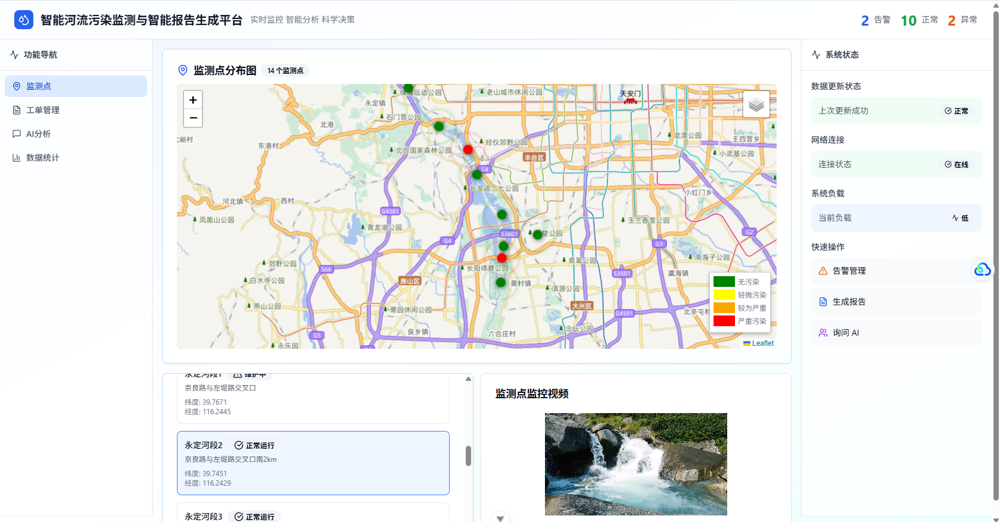
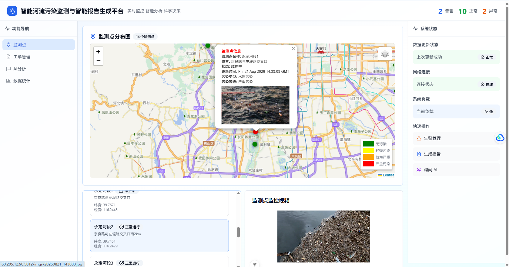
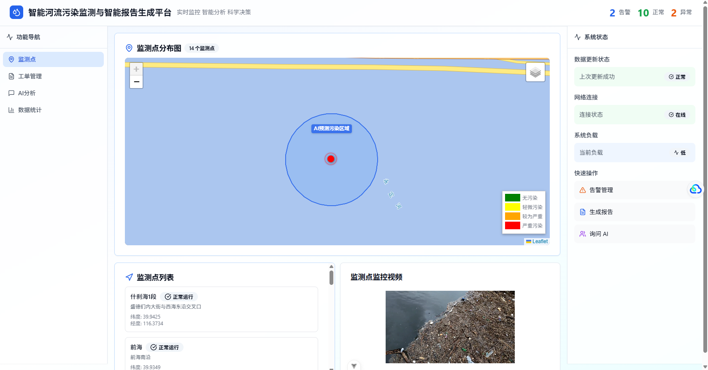
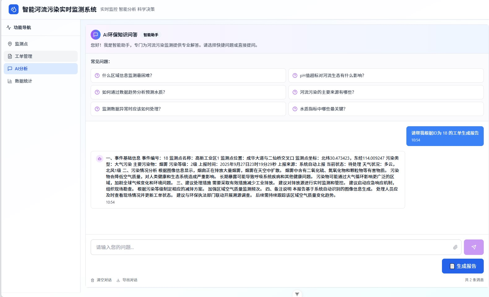
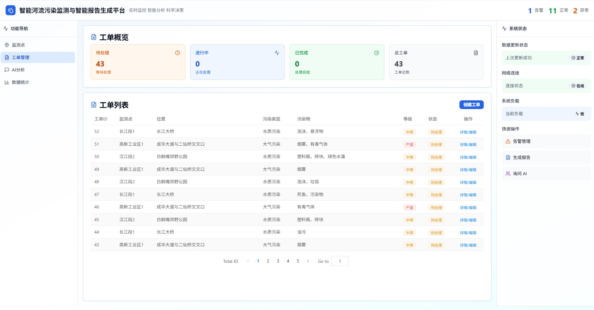
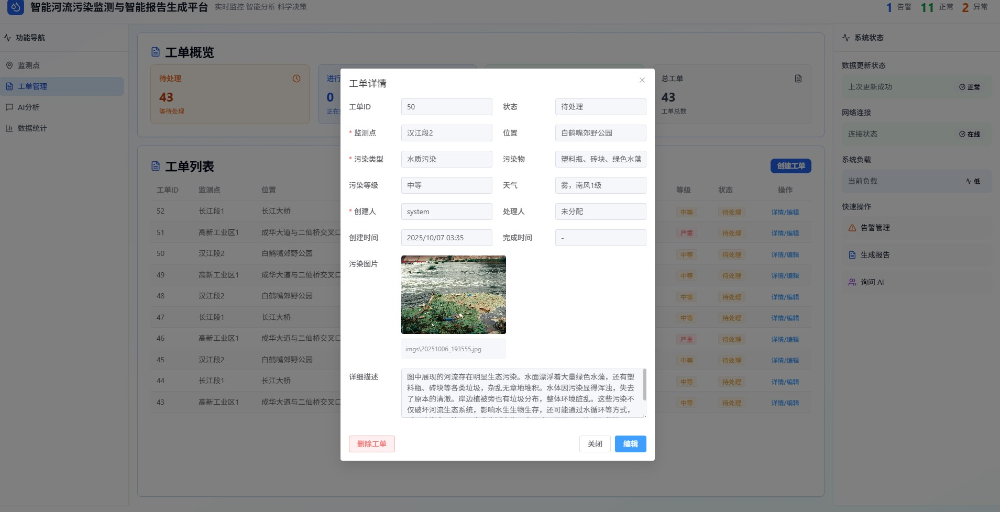
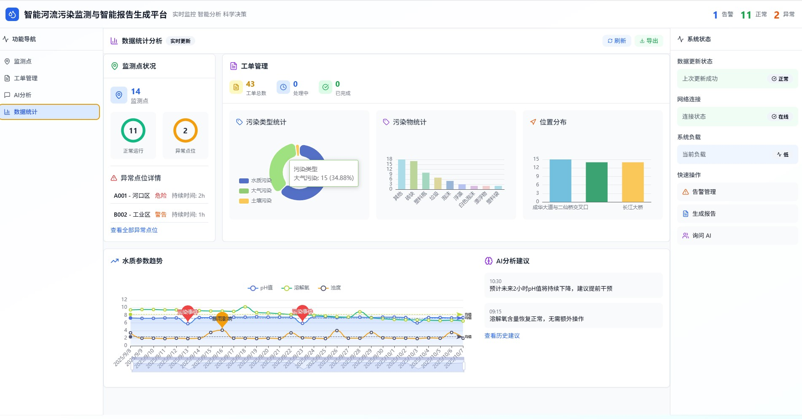

# river-pollutuion-monitor-system

This template should help get you started developing with Vue 3 in Vite.

## Recommended IDE Setup

[VSCode](https://code.visualstudio.com/) + [Volar](https://marketplace.visualstudio.com/items?itemName=Vue.volar) (and disable Vetur).

## Customize configuration

See [Vite Configuration Reference](https://vite.dev/config/).

## Project Setup

```sh
pnpm install
```

### Compile and Hot-Reload for Development

```sh
pnpm dev
```

### Compile and Minify for Production

```sh
pnpm build
```

### 系统介绍

- 本系统旨在通过多模态大模型与WebGIS技术，实现对环境污染的自动化监测、可视化展示与工单化管理。系统结合监控视频流、污染识别模型、污染工单流转及统计分析功能，为环境监管与决策提供科学依据与技术支持。

### 预览








